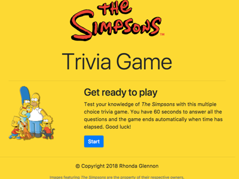

# _The Simpsons_ Trivia Game

Test your knowledge of _The Simpsons_ with this multiple choice trivia game.

Play online at https://rmglennon.github.io/trivia-game.

## Game rules

When you click Start, you will be given 10 multiple-choice questions covering the early seasons of _The Simpsons_. You have 60 seconds to answer all the questions before time runs out; if you finish early, you can quit sooner by clicking Done. When the game ends, your score will be displayed for you.

## Technology

This project was built with JavaScript, jQuery, Bootstrap, HTML, and CSS. Most all of the HTML content is generated dynamically through JavaScript.

*Note: This was created for UC Berkeley Extension coding bootcamp as TriviaGame in week three.*
